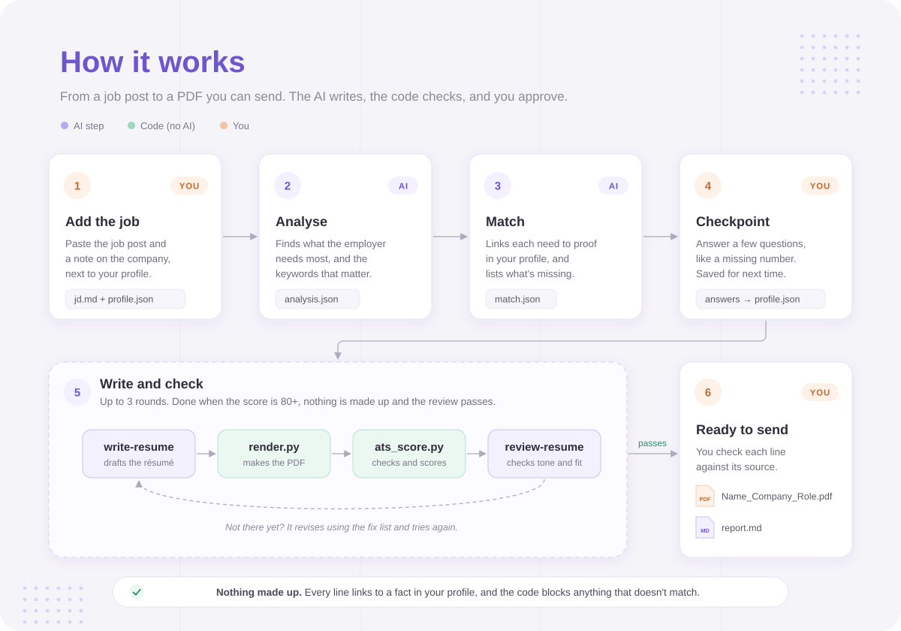
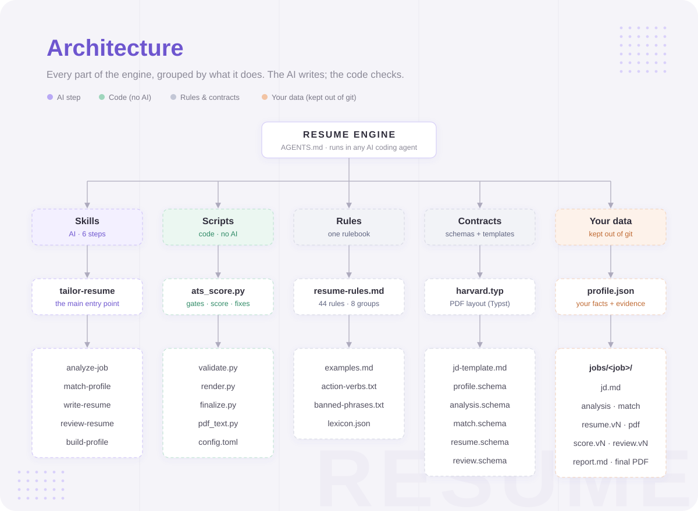

# Resume-engine

Give it a job post and your work history. It writes a résumé for that job, checks it the way hiring software would, and hands you a PDF that's ready to send.

It's built for AI coding agents (Claude Code, Codex CLI, Gemini CLI and others). The AI does the writing; plain Python code does all the checking, so the score doesn't depend on which AI model you use.

## What goes in, what comes out
- **In:** the job post, a short note about the company, and your profile (`profile/profile.json`): every job, achievement and number from your career.
- **Out:** a one-page PDF résumé for that job, plus `report.md` with the score, the gaps, what changed and why, and a table showing where every line came from.

## How it works



<details>
<summary>Text version</summary>

```
job post + company note
│
└── jobs/<date>-<company>-<role>/jd.md
    │
    ├── 1. analyze-job     (AI)    → analysis.json
    │      what the employer needs, the keywords that matter
    │
    ├── 2. match-profile   (AI)    → match.json
    │      your proof for each need, and what's missing
    │
    ├── Checkpoint 1 (you)
    │      answer a few questions, e.g. a missing number
    │      your answers are saved to your profile for next time
    │
    ├── 3. Write and check, up to 3 rounds
    │   ├── write-resume   (AI)    → resume.vN.json
    │   ├── render.py      (code)  → resume.vN.pdf
    │   ├── ats_score.py   (code)  → score.vN.json
    │   └── review-resume  (AI)    → review.vN.json
    │       stops when the score and the review both pass
    │
    └── Checkpoint 2 (you)
           finalize.py (code) → First_Last_Company_Role.pdf + report.md
```

</details>

## Architecture



## The one rule: nothing made up
Every line on the résumé points to a fact in your profile, and every number must match that fact. The code checks this, and if one line fails, the résumé is blocked. If the job asks for something you don't have, the report lists it as a gap. It is never added.

## The score (0–100)
| Part | Points | What it checks |
|---|---|---|
| Keywords | 35 | The job's keywords appear in your bullets or summary. Half credit if they're only in the Skills list; points off if one keyword is repeated too often. |
| Impact | 20 | At least 6 in 10 bullets contain a number. |
| Bullets | 15 | Each one starts with an action verb, stays under two lines, and has no clichés and no "I". |
| Readable | 20 | Everything can be read back from the PDF, the way hiring software (an ATS, applicant tracking system) reads it. |
| Fit | 10 | The job title and the top keywords appear in the tagline or summary. |

The target is 80. The engine also works out the best score your profile *could* get for a job. If that's under 80, it tells you the role is a stretch before writing anything.

## Setup
You need Python 3.11 or newer.

```
python -m venv .venv
.venv\Scripts\activate          # Windows
source .venv/bin/activate       # macOS / Linux
pip install -r requirements.txt
pytest                          # 10 tests should pass
```

## Use it
Open this folder in your AI coding agent and say:
1. **"Build my profile"**: it interviews you, or reads your old CV or LinkedIn PDF.
2. **"Tailor my résumé for this job"**: then paste the job post and the company note.

## Folder map
```
resume-engine/
├── AGENTS.md      start here: instructions for the AI agent
├── CLAUDE.md      points Claude Code to AGENTS.md
├── config.toml    score weights, target, paper size, fonts
├── docs/          the diagrams in this README
├── skills/        the 6 AI steps, one SKILL.md each
├── rules/         rulebook, action verbs, banned phrases, keyword list
├── schemas/       the shape every JSON file must have
├── scripts/       validate, render, score, finalize (no AI)
├── templates/     PDF layout (Typst) and the job note template
├── tests/         tests and made-up sample data
├── profile/       your profile (kept out of git) and profile.example.json
└── jobs/          one folder per application (kept out of git)
```

## How it was built
1. **Collected advice.** It started as notes in an Obsidian vault: a LinkedIn optimiser prompt written from three angles (copywriter, tech recruiter and ATS expert) with a Harvard-style résumé layout, plus Jeff Su's [Résumé Guide for the AI Era](https://www.jeffsu.org/resume-ai-era-guide/) and [AI-Era Résumé Toolkit](https://jeffsu.notion.site/ai-era-resume-toolkit-jeff-su).
2. **Merged it into one rulebook.** The sources overlap and sometimes disagree. `rules/resume-rules.md` keeps one version of each rule, with an ID and its source, and records every decision. For example, Google's XYZ bullet formula won over CAR/STAR, and `[X%]` placeholders are never allowed.
3. **Split the AI work from the checking.** Writing and judging tone are AI skills written in plain Markdown. Anything that can be checked exactly (facts, numbers, keywords, whether the PDF can be read) is Python code, so you get the same result with any model.
4. **Tested with made-up data.** A fictional candidate and two fictional job posts in `tests/` show that the checks and the PDF work.

Planned and built with Claude Code as a weekend project.

## Privacy
`profile/profile.json` and `jobs/` hold your name, contact details and work history, so `.gitignore` keeps them out of git. Keep it that way if the repo is public. Only `profile/profile.example.json` is published, as a sample to copy.
